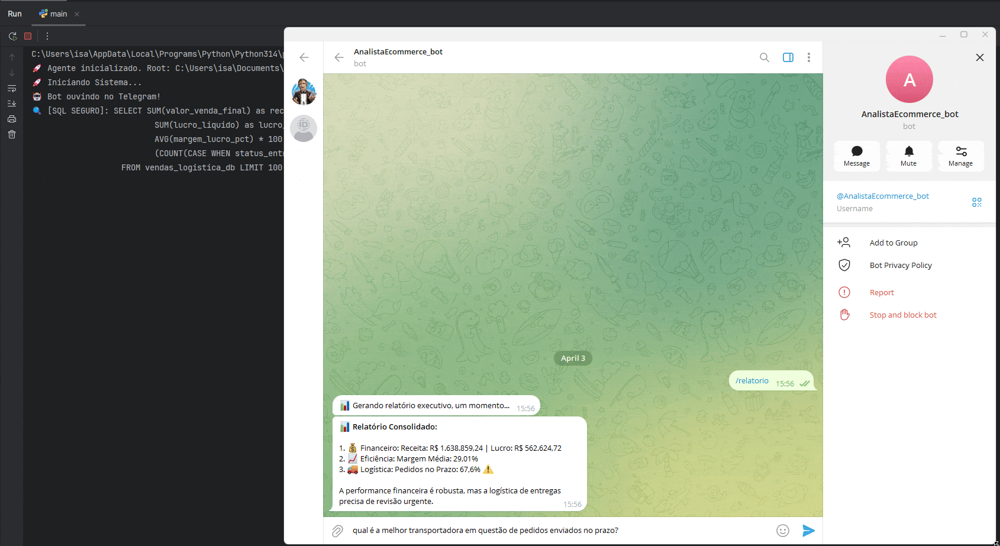
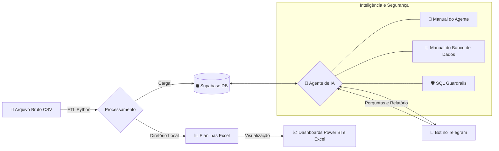
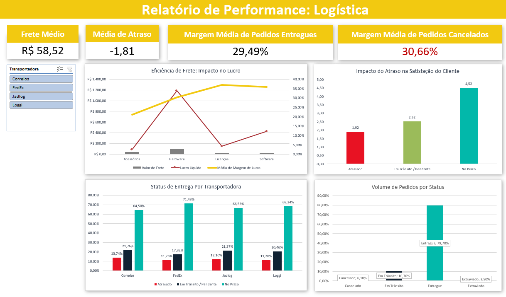
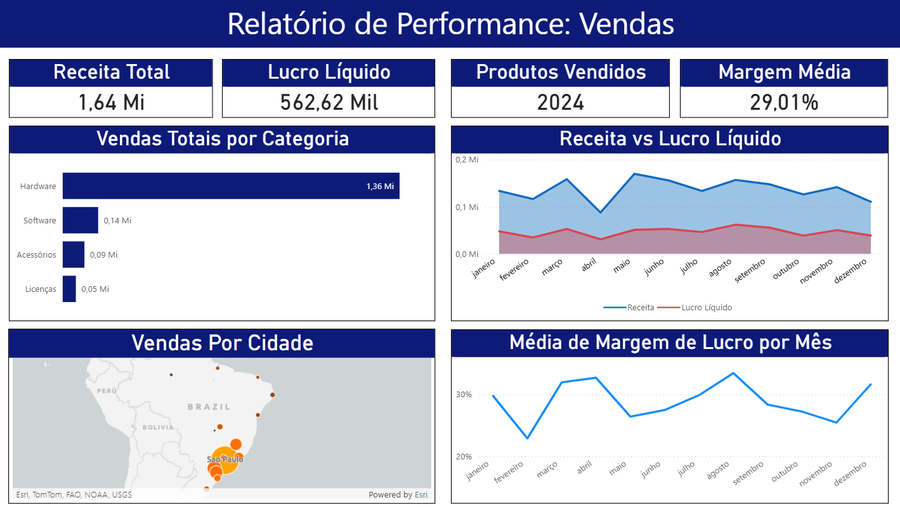

# 🤖 Analista de E-commerce: Agente de IA + Dashboards de Performance</h1>

  

## 🔍 Sobre o Projeto
Este projeto integra **Dashboards de Performance (Power BI & Excel)** a um **Agente de IA (Gemini)** para análise de dados de e-commerce, utilizando um processo de **ETL em Python** para centralizar informações em um **banco de dados em nuvem (Supabase)** e entregar **insights estratégicos e relatórios via Telegram**.

## 🛠️ Arquitetura do Sistema

## ✨ Funcionalidades Principais
- 💬 **Consultas em Linguagem Natural**: Permite interação com o banco de dados via **Telegram**, permitindo que os gestores façam perguntas complexas sem precisa saber SQL.
- 📋 **Relatórios Executivos**: Geração de relatórios financeiros e logísticos via comando `/relatorio`, entregando KPIs essenciais rapidamente.
- 🛡️ **Camada de Segurança**: Implementação de **Guardrails** que validam as queries geradas pela IA, prevenindo execuções maliciosas no banco de dados.
- 🔄 **Pipeline de Dados (ETL)**: Fluxo contínuo em **Python** que transforma dados brutos de arquivos CSV/Excel em tabelas estruturadas no **Supabase**, garantindo que tanto os Dashboards quanto o Agente de IA trabalhem com uma **única fonte de dados**.

## 📊 Dashboards de Performance
📖 [Clique aqui para acessar o Estudo de Caso com análises de negócio no Notion](https://www.notion.so/Relat-rio-Executivo-Vendas-e-Log-stica-337c229d45f0804cbf39cf9944aa0fd3?source=copy_link)

  

  

## 💻 Tecnologias
- **Linguagem**: Python (Pandas, NumPy, Openpyxl)
- **IA & LLM:** Google Gemini (SDK `google-genai`)
- **Banco de Dados:** Supabase / PostgreSQL (SQLAlchemy & Psycopg2)
- **Interface:** Telegram Bot API (`python-telegram-bot`)
- **Visualização**: Power BI & Excel (Dashboards e KPIs dinâmicos)

## 👩‍💻 Autor
- Projeto desenvolvido por [Isabel Henrique](https://www.linkedin.com/in/isabel-henrique/)